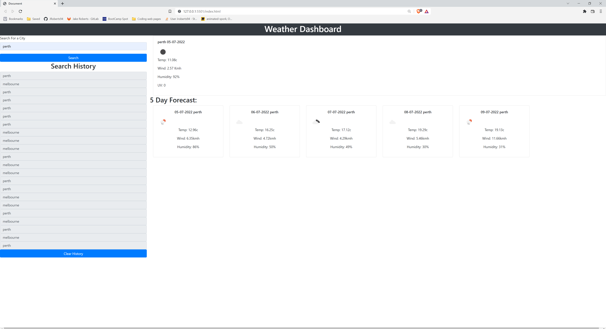

# 06 Server-Side APIs: Weather Dashboard

## The Task

This weeks project was to create a weather dashboard that gets data from the openWeather API and ddisplay current and future forecasts for a city based on what the user searches for.
Tasks needed where to call the api, get the data, display andd generate the data into the DOM, show previous searches and make the history citys clickable to re-search them.

## User Story

```
AS A traveler
I WANT to see the weather outlook for multiple cities
SO THAT I can plan a trip accordingly
```

## Acceptance Criteria

```
GIVEN a weather dashboard with form inputs
WHEN I search for a city
THEN I am presented with current and future conditions for that city and that city is added to the search history
WHEN I view current weather conditions for that city
THEN I am presented with the city name, the date, an icon representation of weather conditions, the temperature, the humidity, the wind speed, and the UV index
WHEN I view the UV index
THEN I am presented with a color that indicates whether the conditions are favorable, moderate, or severe
WHEN I view future weather conditions for that city
THEN I am presented with a 5-day forecast that displays the date, an icon representation of weather conditions, the temperature, the wind speed, and the humidity
WHEN I click on a city in the search history
THEN I am again presented with current and future conditions for that city
```

## Technology used
HTML
CSS
Javascript
JQuery
Bootstrap
Moment

* [Link to deployed Website]()
* [Link to github Repository](https://github.com/JRoberts94/week6-WeatherApp)
* 